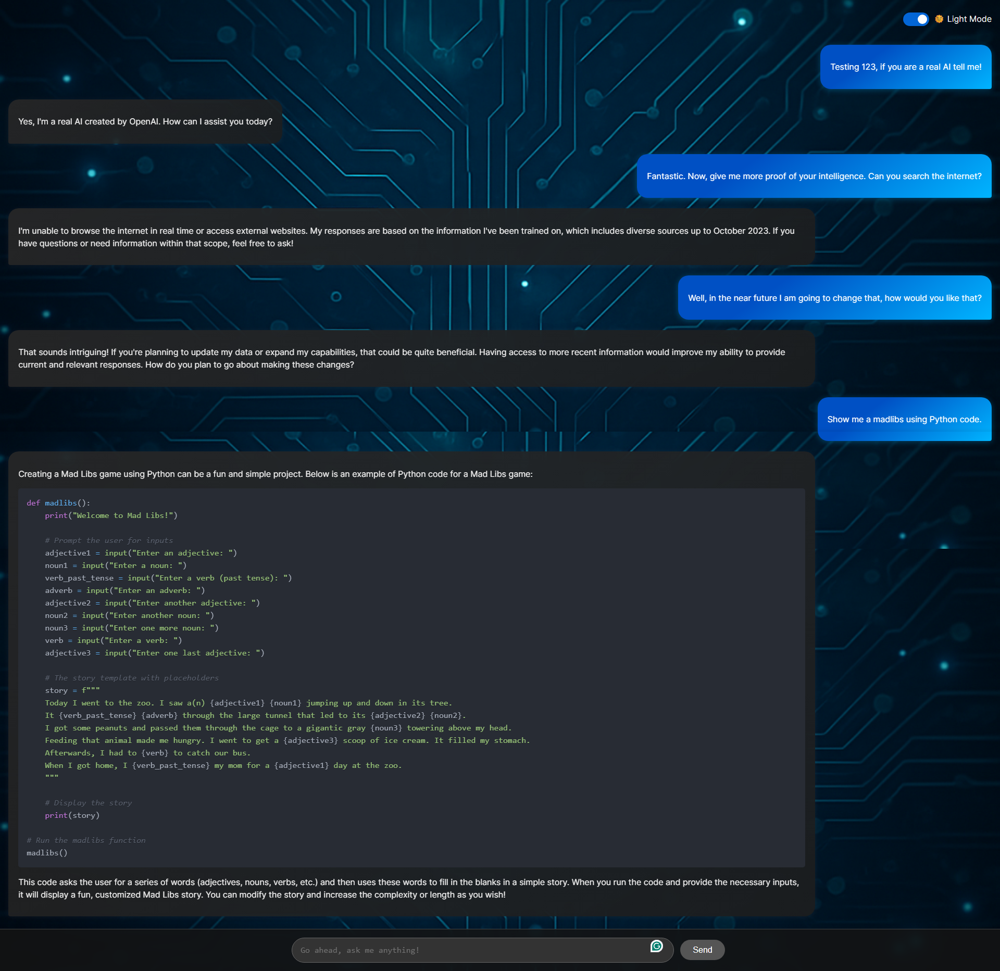

# 🤖 React LLM Chat UI – *Eugenius at your service...*

Welcome to the sleek, animated, markdown-ready front-end for your custom LLM chatbot, **Eugenius**. Designed with personality, performance, and a polished developer experience in mind.



## 🌐 Live Demo
[👉 Click here to try it live](https://react-llm-chat.vercel.app/)

## ✨ Features
- 🎨 Typewriter text animation
- 💬 Scrollable chat history with auto-scroll
- 🌗 Dark/Light mode toggle
- 🧠 Markdown rendering with syntax highlighting
- 🐱 Custom Lottie loader animation (RainbowCat!)
- 💡 Environment variable driven API endpoint (Vite)

## 🔧 Tech Stack
- **React 18** + **Vite**
- **TypeScript**
- **ReactMarkdown** + **Prism** for code blocks
- **Lottie-React** for playful loaders
- **Tailored CSS** (responsive, minimal-glass look)

## 🚀 Getting Started

```bash
git clone https://github.com/LewallenAE/react-llm-chat.git
cd react-llm-chat
npm install
echo "VITE_API_URL=http://localhost:3000" > .env.local
npm run dev
